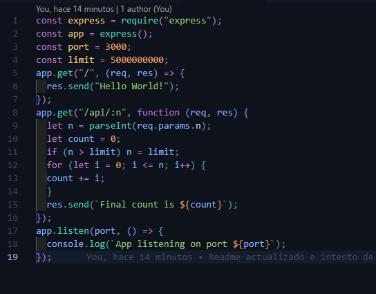
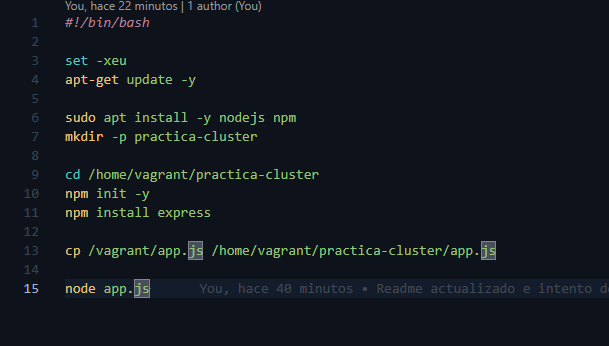
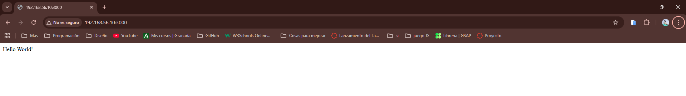
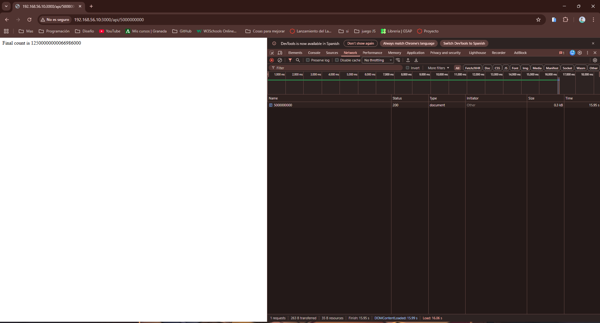
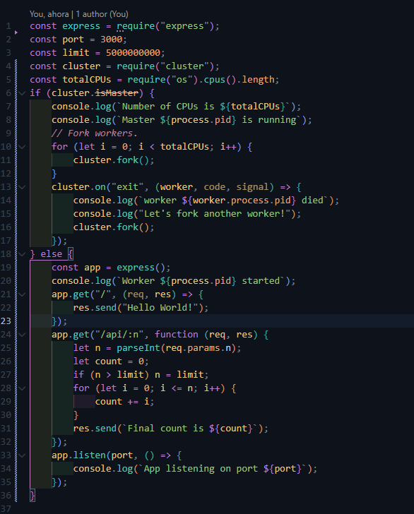
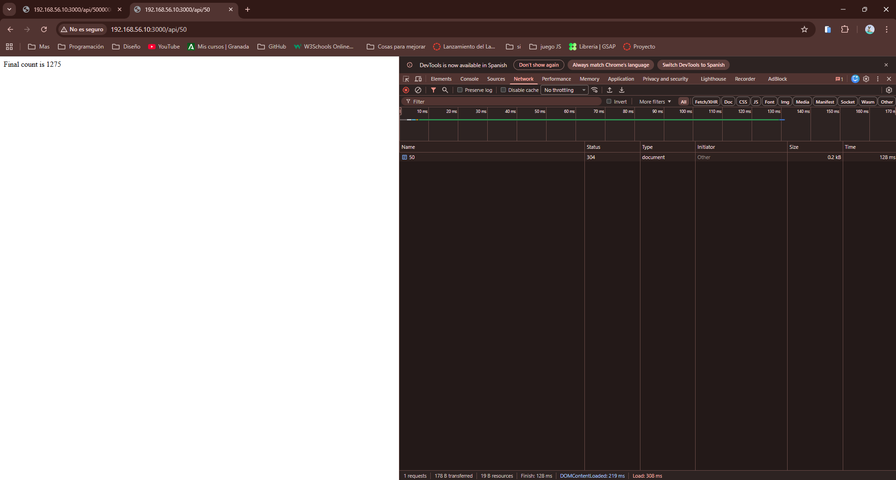
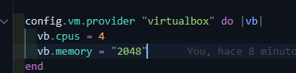
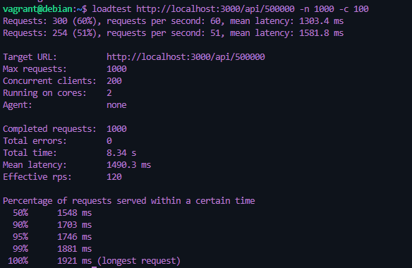

# Despliegue-de-una-aplicaci-n-en-Cluster-con-NodeJS-y-Express

## 2. Usando los clusters
### 2.1 Primero sin clúster

Vamos a crear una maquína como hasta ahora, básica y vamos a entrar a ella con un `vagrant ssh` después de realizar un `vagrant up`.

Para agilizar un poco, dentro del bootstrap.sh, podemos dejar la carpeta necesaria creada, con `mkdir practica-cluster`, y la instalacion necesaria para realizar la práctica, como son `npm` y `nodejs` incluso realizar todo dentro del bootstrap.sh para intentar lanzarlo autmáticamente al arrancar la maquína.

Le tenemos que pasar el archivo `app.js` que hemos creado fuera de la maquína, para que lo podamos lanzar durante el arranque.
;
El contenido de este archivo es proporcionado en el pdf.

De momento nuestro bootstrap.sh quedaría así: 
;

Y ahora cuando nos metemos en la dirección `192.168.56.10:3000` podemos ver que nos está lanzando el archivo `app.js` que hemos creado, vemremos la pantalla de `Hello World!`.
;

Ahora vamos a empezar con las pruebas propuestas en el pdf, ya que como dice, tenemos dos rutas, una es la que devuelve el hello world y la otra es la de la API, a la cual le tenemos que pasar diferentes números como parámetros, para ver los resultados devueltos.

Prueba 1 con valor de n = 50:
;
Como vemos tiene una respueta muy rápida

Prueba 2 con valor de n = 5000000000:
;
En este segundo caso, como vemos, el tiempo de respuesta es bastante más grande, llegando a tardar hasta 16 segundos.

### 2.2 ¡Ahora con más clúster!
Lo primero que tenemos que hacer ahora es modificar el archivo de `app.js`, siendo de nuevo el dado en la práctica.
;

Vamos a ver como afecta esto a los mismos dos casos que hemos realizado anteriormente, pero antes tenemos que realizar un `vagrant reload` para que los cambios se apliquen.

Después de unos cuantos errores, he visto que tengo que cambiar una línea para que funcione, y es la siguiente;
;

Y además añadir `config.vm.network "forwarded_port", guest: 3000, host: 3000` al archivo `Vagrantfile` para que nos permita acceder a la aplicación desde el host.

Cuando vuelve a funcionar la aplicación, vamos a ver los resultados de las pruebas que hemos mencionado antes.

Prueba 1 con valor de n = 50:
;

Prueba 2 con valor de n = 5000000000:
;

Como podemos ver los tiempos han bajado, y la respuesta es más rápida.
Pero para esto he tenido que especificarle a la máquina que use 4 nucleos: 
;

Por tanto, como es algo obvio, el rendimiento aumentará con más nucleos.

## 3. Métricas de rendimiento

Vamos a instalar un programa llamado `loadtest` para realizar las pruebas de rendimiento, ya que este nos permite realizar simular una gran cantidad de conexiones.
Para la instalación, vamos a usar el comando `npm install -g loadtest`.

Ahora abrimos una nueva terminal y lanzamos la prueba: 
;

Ahora vamos a ir lanzando diferentes pruebas, para ver como se comportan los resultados.
La siguiente prueba es sin clúster.
Para esto tenemos que poner el primer codigo para `app.js` que hemos utilizado, y luego volver a lanzar la maquína para después hacer la prueba correspondiente.
;

Como podemos ver, la respuesta es mas lenta, ya que al quitarle los clústers, el tiempo de respuesta aumenta.